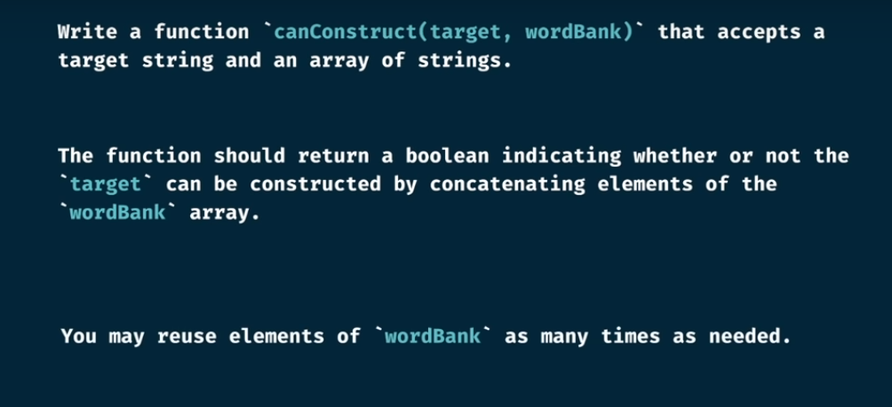
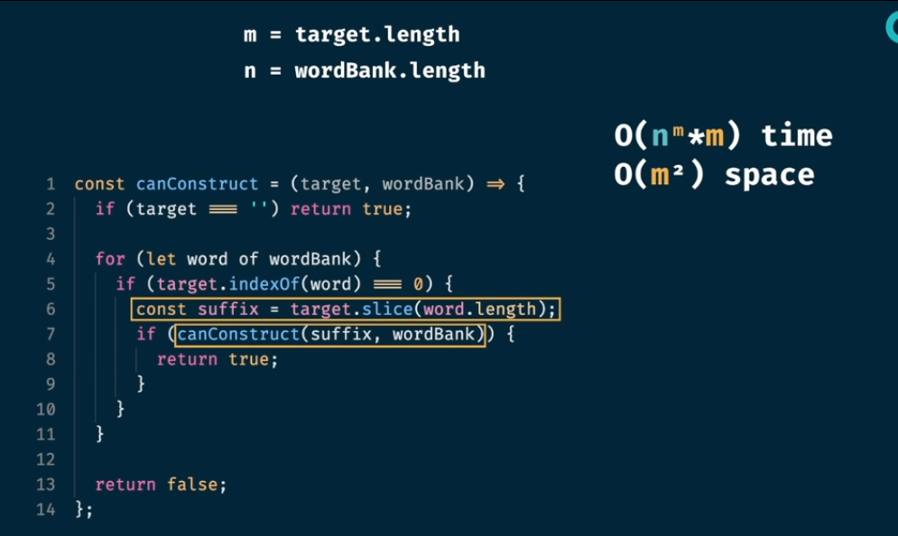
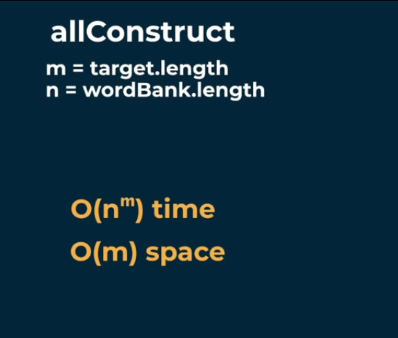
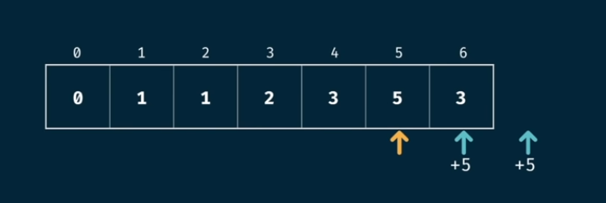
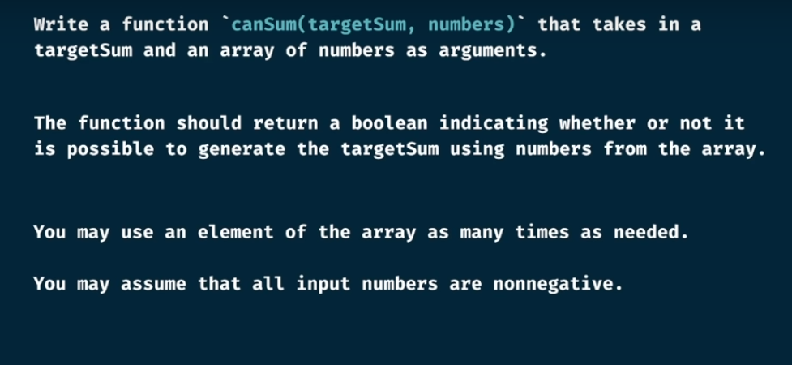

# Big O notation (time complexity)

# Recursion

# Grid traverse - memoization

# CanSum - memoization

# howSum() - memoization

bestSum()

canConstruct

We cannot take out any string from the middle, because it leads to creating a new string combination which do not exist. It will impact other moves

countConstruct()

allConstruct()

fib - tabulation

 

gridTraverse

# Tabulation recipe

- visualize the problem as a table
- size the table based on the inputs
- initialize the table with default values
- seed the trivial answer into the table (answer of some base case)
- iterate through the table
- fill further positions based on the current position

# canSum - tabulation

# 

