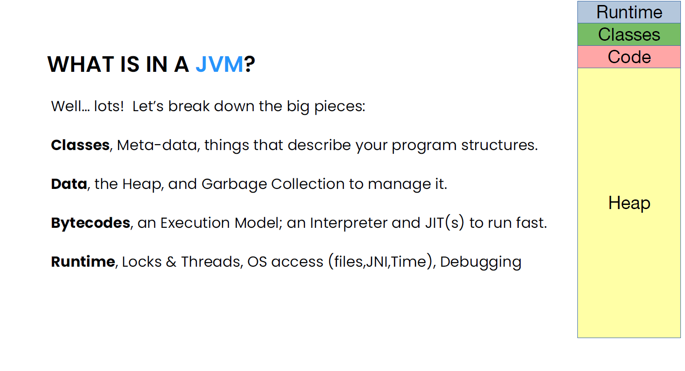
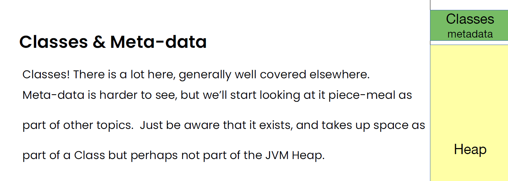
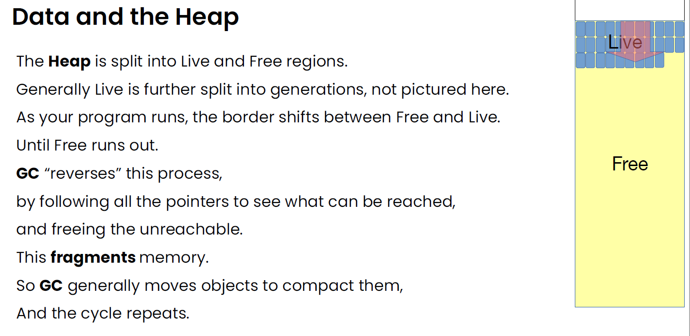
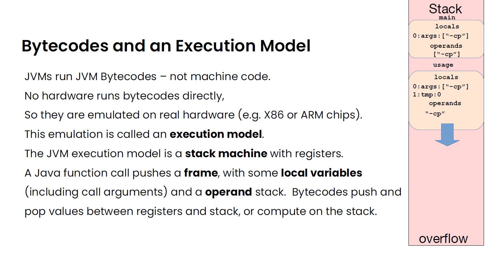

# 1.  Java Basic

## Explain JDK, JRE and JVM?

| **JDK**                                                      | **JRE**                                                      | **JVM**                                                      |
| ------------------------------------------------------------ | ------------------------------------------------------------ | ------------------------------------------------------------ |
| It stands for Java Development Kit.                          | It stands for Java Runtime Environment.                      | It stands for Java Virtual Machine.                          |
| It is the tool necessary to compile, document and package Java programs. | JRE refers to a runtime environment in which Java bytecode can be executed. | It is an abstract machine. It is a specification that provides a run-time environment in which Java bytecode can be executed. |
| It contains JRE + development tools.                         | It’s an implementation of the JVM which physically exists.   | JVM follows three notations: Specification, **Implementation,** and **Runtime Instance**. |

## Access modifiers

| Modifier    | Class | Package | Subclass | World |
| ----------- | ----- | ------- | -------- | ----- |
| `public`    | Y     | Y       | Y        | Y     |
| `protected` | Y     | Y       | Y        | N     |
| no modifier | Y     | Y       | N        | N     |
| `private`   | Y     | N       | N        | N     |

# **2. What all does JVM comprise of?**



## **Classes & Meta-data** 

Classes! Java has classes, this is easy! Classes form a tree, rooted at Object. They have a super-class and some subclasses (and interfaces). They have fields and methods. They are initialized (or not), and the <clinit> has run (or not). They might have inner classes, or be “Single Abstract Method”. They have instances. They can be abstract or have custom Loaders or Security Domains or annotations or... Meta-data! There is also internal meta-data, not available via reflection. Object field layout: offset & size. Padding. Profiling data on methods, but also on fields, locks, exceptions. JIT’d code. Safepoints and OopMaps. GC and heap-walking support, and much more.



### Single Abstract Method (SAM) and Functional Interface in Java

Interface that has single abstract method (**SAM**), is known as functional interface. We can supply a lambda expression whenever an object of an functional interface is expected.

Example of functional interface:

Callable is a FunctionalInterface

```java
package java.util.concurrent;

@FunctionalInterface    
public interface Callable<V> {

    V call() throws Exception;
}
```

The compiler will treat any interface meeting the definition of a functional interface as a functional interface regardless of whether or not a FunctionalInterface annotation is present on the interface declaration.

Callable using lambda expression

```java
Callable<String> aCallable = () -> "dummy";
```

Another example of SAM using lambda

```java
class Worker {
    ExecutorService executor = Executors.newSingleThreadExecutor();

    public<T> Future<T> invoke(Callable<T> runnable) {
        return executor.submit(runnable);
    }
}

class Client {
    public void execute() {
        Worker worker = new Worker();
        worker.invoke(() -> {
            System.out.println("this is an lambda work");
            return "result";
        });
    }
```

## Data and the Heap

 Data is stored in Objects, and Objects are stored in the Heap. Objects are made with ‘new’ and reclaimed with GC. The Heap probably is the largest user of your machine resources. Working with those Objects probably uses most of you dev cycles.



The mutator (Java program) “pumps” memory from Free to Live. GC “pumps” memory from Live to Free. These two forces must balance out (or you die Out of Memory), But they have different CPU costs. The allocation rate (and CPU cost) is up to the developer. The GC costs depend on the structure of the heap, and that structure is also up to the developer. But always, fewer objects & pointers cost less than more of either. A million Longs are hugely more expensive than a single long[1000000].


## **Bytecodes and an Execution Model**



Since no real machine runs this, the java virtual machine emulates it. The interpreter runs one bytecode at a time, and is fairly slow. But it can start immediately! The interpreter also profiles: it counts functions (and loops), and when the count is large enough, it triggers a compilation. The Just In Time compiler, or JIT, compiles hot bytecodes into real machine code. The JIT’d code runs about 10 times faster than the interpreter.

The JVM Runtime The JVM Runtime is basically a “catch all” for everything else. The runtime tracks: 

- Threads & thread stacks - Classes loaded 
- State of the Heap, and triggers GC as needed 
- Profiled code, and triggers JIT’ing when needed 
- Catches hardware exceptions and turns them into JVM exceptions 
- Handles slow-path locking, blocking & waking threads
- Handles I/O and native calls - … and much much more Runtime


## Compiler


## Virtual Machine


## Java Garbage Collection

Java Garbage Collection is the process by which Java programs perform automatic memory management. Java programs compile into bytecode that can be run on a Java Virtual Machine (JVM).

When Java programs run on the JVM, objects are created on the heap, which is a portion of memory dedicated to the program.

Over the lifetime of a Java application, new objects are created and released. Eventually, some objects are no longer needed. You can say that at any point in time, the heap memory consists of two types of objects:

- *Live* - these objects are being used and referenced from somewhere else
- *Dead* - these objects are no longer used or referenced from anywhere

The garbage collector finds these unused objects and deletes them to free up memory.

## **Stack Memory in Java**

**Stack Memory in Java is used for static memory allocation and the execution of a thread.** It contains primitive values that are specific to a method and references to objects that are in a heap, referred from the method.

Access to this memory is in Last-In-First-Out (LIFO) order. Whenever a new method is called, a new block on top of the stack is created which contains values specific to that method, like primitive variables and references to objects.

When the method finishes execution, it’s corresponding stack frame is flushed, the flow goes back to the calling method and space becomes available for the next method.

# 3 Big O

Big O time is the language and metric we use to describe the efficiency of algorithms. Not understanding it thoroughly can really hurt you in developing an algorithm. Not only might you be judged harshly for not really understanding big 0, but you will also struggle to judge when your algorithm is getting faster or slower

This is what the concept of asymptotic runtime, or big O time, means. We could describe the data transfer "algorithm" runtime as:

- Electronic Transfer: 0( s ), where s is the size of the file. This means that the time to transfer the file
  increases linearly with the size of the file. (Yes, this is a bit of a simplification, but that's okay for these
  purposes.)
- Airplane Transfer: 0( 1) with respect to the size of the file. As the size of the file increases, it won't take any longer to get the file to your friend. The time is constant.

# 4 OOP concepts

## Polymorphism

Polymorphism means "many forms", and it occurs when we have many classes that are related to each other by inheritance.

Like we specified in the previous chapter;  [**Inheritance**](https://www.w3schools.com/java/java_inheritance.asp) lets us  inherit attributes and methods from another class. **Polymorphism**  uses those methods to perform different tasks. This allows us to perform a single  action in different ways.

For example, think of a superclass called `Animal` that has a method called `animalSound()`. Subclasses of Animals could be Pigs, Cats, Dogs, Birds - And they also  have their own implementation of an animal sound (the pig oinks, and the cat meows, etc.):

### **Static polymorphism**

Java, like many other object-oriented programming languages, allows  you to implement multiple methods within the same class that use the  same name but a different set of parameters. That is called [method overloading](https://docs.oracle.com/javase/tutorial/java/javaOO/methods.html) and represents a static form of polymorphism.

The parameter sets have to differ in at least one of the following three criteria:

- They need to have a different number of parameters, e.g. one method accepts 2 and another one 3 parameters.
- The types of the parameters need to be different, e.g. one method accepts a *String* and another one a *Long.*
- They need to expect the parameters in a different order, e.g. one method accepts a *String* and a *Long* and another one accepts a *Long* and a *String*. This kind of overloading is not recommended because it makes the API difficult to understand.

In most cases, each of these overloaded methods provides a different but very similar functionality.

Due to the different sets of parameters, each method has a different [signature](https://www.thoughtco.com/method-signature-2034235). That allows the compiler to identify which method has to be called and  to bind it to the method call. This approach is called static binding or static polymorphism.

### **Runtime or Dynamic Polymorphism**

In the Dynamic Polymorphism, a call  to a single overridden method is solved during a program’s runtime.  Method overriding is one of the prominent examples of Runtime  Polymorphism. In this process, the overriding is done through pointers  and virtual functions.

- In Method  Overriding, a single method is declared in a sub-class present in a  parent class. The child class gains a method for implementation.
- During  Runtime Polymorphism, the class offers the specification of its own to  another inherited method. This transfer between methods is achieved  without modifying the parent class object codes.

## Association

## Association

Association is the weakest relationship between the three. **It isn't a “has-a” relationship**, none of the objects are parts or members of another.

**Association only means that the objects “know” each other.** For example, a mother and her child.


## Aggregation

Aggregation is also a “has-a” relationship. What distinguishes it from composition, that it doesn't involve owning. As a result, the lifecycles of the objects aren't tied: every one of them can exist independently of each other.

For example, a car and its wheels. **We can take off the wheels, and they'll still exist.** We can mount other (preexisting) wheels, or install these to another car and everything will work just fine.

Of course, a car without wheels or a detached wheel won't be as useful as a car with its wheels on. But that's why this relationship existed in the first place: to **assemble the parts to a bigger construct, which is capable of more things than its parts**.

## Composition

*Composition* is a “belongs-to” type of relationship. It means that one of the objects is a logically larger structure, which contains the other object. In other words, it's part or member of the other object.

Alternatively, **we often call it a “has-a” relationship** (as opposed to an “is-a” relationship, which is [inheritance](https://www.baeldung.com/java-inheritance)).

For example, a room belongs to a building, or in other words a building has a room. So basically, whether we call it “belongs-to” or “has-a” is only a matter of point of view.

Composition is a strong kind of “has-a” relationship because the containing object owns it. Therefore, **the objects' lifecycles are tied. It means that if we destroy the owner object, its members also will be destroyed with it.** For example, the room is destroyed with the building in our previous example.

Note that doesn't mean, that the containing object can't exist without any of its parts. For example, we can tear down all the walls inside a building, hence destroy the rooms. But the building will still exist.

# 4 Data structures

## Array

https://docs.oracle.com/javase/tutorial/java/nutsandbolts/arrays.html

An *array* is a container object that holds a fixed number of  values of a single type. The length of an array is established when the  array is created. After creation, its length is fixed. 

### Features

- tablice są doskonałym wyborem gdy elementy są odczytywane nie po kolei, ponieważ dostęp do kazdego z nich jest natychmiastowy
- kiedy należy wstawić element do środka listy sa lepszym wyborem, ponieważ wystarczy tylko zmienic referencje następnego elementu oraz poprzedniego, w tablicy natomiast musielibyśmy przesunąć wszystkie elementy znajdujące się za miejscem wstawienia
- dostęp swobodny, możliwość przejścia bezpośrednio do 10 elementu

### Efficency

Odczyt = O(1)

Wstawianie = O(n)

Usuwanie = O(n)

## ArrayList 

https://stackoverflow.com/questions/322715/when-to-use-linkedlist-over-arraylist-in-java

ArrayList can be perceived as a dynamic array that allows you to add or  remove elements from it any time or simply said, dynamically. In other words, its size can increase or decrease dynamically unlike arrays whose size remains static once declared.


### Features

- The ArrayList class of Java stores elements by maintaining the insertion order.
- The ArrayList allows duplicate elements stored in it.
- ArrayList is not synchronized, the major point that differentiates the ArrayList from Vector class in Java.
- The ArrayList class cannot contain primitive types but only objects. In  this case, we usually call it as ‘ArrayList of objects’. So if you want  to store integer type of elements, then you have to use the Integer  object of the wrapper class and not primitive type int.
- Also, if you have large lists, keep in mind that memory usage is also different. Each element of a `LinkedList` has more overhead since pointers to the next and previous elements are also stored. `ArrayLists` don't have this overhead. However, `ArrayLists` take up as much memory as is allocated for the capacity, regardless of whether elements have actually been added.
- The default initial capacity of an `ArrayList` is pretty  small (10 from Java 1.4 - 1.8). But since the underlying implementation  is an array, the array must be resized if you add a lot of elements. To  avoid the high cost of resizing when you know you're going to add a lot  of elements, construct the `ArrayList` with a higher initial capacity.

### Efficency

Odczyt = O(1)

Wstawianie = O(n)

Usuwanie = O(n)

## String pool

###  **What is Java String Pool?**

Java String pool refers to a collection of Strings which are stored in heap  memory. In this, whenever a new object is created, String pool first  checks whether the object is already present in the pool or not. If it  is present, then the same reference is returned to the variable else new object will be created in the String pool and the respective reference  will be returned.

****

## Linked List (Listy powiązane)

https://stackoverflow.com/questions/322715/when-to-use-linkedlist-over-arraylist-in-java

### Single Linked list

każdy element zawiera adres nastepnego elementu na liscie, w ten sposób grupa losowa wybranych adresów w pamięci zostałą ze sobą powiązana.


The “Head” of the LinkedList is a pointer that contains the address of  the first element in the LinkedList. The last node in the LinkedList is  the tail. As shown in the figure above, the address part of the last  node in the LinkedList is set to ‘Null’ indicating the end of the  LinkedList.

### **Doubly Linked List**

https://docs.oracle.com/javase/7/docs/api/java/util/LinkedList.html

Doubly-linked list implementation of the `List` and `Deque` interfaces.  Implements all optional list operations, and permits all elements (including `null`).  

There is another version known as “**Doubly Linked List**” whose each node has three parts:

1. Address or reference or pointer to the previous element in the LinkedList.
2. Data part
3. Address or reference or pointer to the next element in the LinkedList.

The previous address of the first element in the LinkedList will be  set to Null while the next pointer of the Last element in the LinkedList is set to Null.

**Representation Of Doubly Linked List:**


### Java LinkedList Class

In Java, the linked list is implemented by the “***LinkedList\***” class. This class belongs to the “***java.util\***” package. The LinkedList class implements the List and Deque interfaces and inherits the AbstractList class.


### LinkedList features:

- Listy powiązane są swietnym rozwiązaniem gdy wiadomo że i tak trzeba będzie odczytywać wszystkie elementy na raz, wówczas można odczytać jeden element, odczytać adres następnego itd.
- Jeżeli zamierzamy odczytywac elementy niereguralnie lista powiązana jest złym wyborem
- Dostęp sekwencyjny, aby odczytać 10 element listy należy najpierw odczyta 9 poprzednich
- kiedy należy wstawić element do środka listy sa lepszym wyborem, ponieważ wystarczy tylko zmienic referencje następnego elementu oraz poprzedniego, w tablicy natomiast musielibyśmy przesunąć wszystkie elementy znajdujące się za miejscem wstawienia
- Also, if you have large lists, keep in mind that memory usage is also different. Each element of a `LinkedList` has more overhead since pointers to the next and previous elements are also stored. `ArrayLists` don't have this overhead. However, `ArrayLists` take up as much memory as is allocated for the capacity, regardless of whether elements have actually been added.
- The default initial capacity of an `ArrayList` is pretty  small (10 from Java 1.4 - 1.8). But since the underlying implementation  is an array, the array must be resized if you add a lot of elements. To  avoid the high cost of resizing when you know you're going to add a lot  of elements, construct the `ArrayList` with a higher initial capacity.

### Efficency

Odczyt = O(n)

Wstawianie = O(1)

Usuwanie = O(1)

## Maps

Maps collection in Java is a collection that maps a key to a value. It  is a collection consisting of keys and values. Each entry in the map  consists of a key with its corresponding value. The keys are unique in  maps. Maps can be used typically when we need to modify a collection  based on a key value.

The map in Java is a part of the java.util.map interface. The map  interface **is not a part of the collection** interface and that is the  reason for which maps are different from the other collections.


### Features

1. In maps, each key can map to the at most one value. Also, there cannot be duplicate keys in maps.
2. Map implementations like HashMap and LinkedHashMap allow null key and null values. However, TreeMap does not allow it.
3. A map cannot be traversed as it is. Hence for traversing, it needs to be converted to set using keyset () or entrySet () method.

## Set

Set in Java is an interface that is a part of the Java Collection  Framework and implements the Collection interface. A set collection  provides the features of a mathematical set.

A set can be defined as a collection of unordered objects and it  cannot contain duplicate values. As the set interface inherits the  Collection interface, it implements all the methods of the Collection  interface.


### Features

1. The set interface is a part of the Java Collections Framework.
2. The set interface allows for unique values.
3. It can have at most one null value.
4. Java 8 provides a default method for the set interface – Spliterator.
5. The set interface does not support the indexes of the elements.
6. The set interface supports generics.

## Vectors

A vector can be defined as a dynamic array that can grow or shrink on its own i.e. vector will grow when more elements are added to it and  will shrink when elements are removed from it.

This behavior is unlike that of arrays which are static. But similar  to arrays, vector elements can be accessed using integer indices.

A vector can be viewed as similar to another dynamic array data structure, **ArrayList except for the two below differences:**

- The vector is synchronized i.e. all the methods in Vector are marked ‘synchronized’ and thus once a method is invoked, the same method  cannot be invoked unless the previous call has ended.
- The vector class has many methods that are not a part of the collections framework but its legacy methods.

## Stack

In programming, a stack is an abstract, linear data type with a  predefined capacity (or boundary). It follows a particular order for  adding or removing elements. Linear data structures organize their  components in a straight line, so if we we add or remove an element,  they will grow or shrink respectively.

The stack data structure is precisely what it sounds like: a stack of data. In certain types of problems, it can be favorable to store data in a stack rather than in an array. A stack uses LIFO (last-in first-out) ordering. That is, as in a stack of dinner plates, the most recent item added to the stack is the first item to be removed.
It uses the following operations:

- pop ( ) : Remove the top item from the stack.

- push ( i tern): Add an item to the top of the stack.

- peek(): Return the top of the stack.

- is Empty (): Return true if and only if the stack is empty.

  

  Unlike an array, a stack does not offer constant-time access to the i th item. However, it does allow constanttimeadds and removes, as it doesn't require shifting elements around.

  One case where stacks are often useful is in certain recursive algorithms. Sometimes you need to push temporary data onto a stack as you recurse, but then remove them as you backtrack (for example, because the recursive check failed). A stack offers an intuitive way to do this.

data structure and big o

# 5 Base design patterns

## Singleton

The Singleton pattern ensures that a class has only one instance and ensures access to the instance through the application. It can be useful in cases where you have a "global" object with exactly one instance. For example, we may want to implement Restaurant such that it has exactly one instance of Restaurant.

It should be noted that many people dislike the Singleton design pattern, even calling it an "anti-pattern:' One reason for this is that it can interfere with unit testing.

```java
// The Database class defines the `getInstance` method that lets
// clients access the same instance of a database connection
// throughout the program.
class Database is
    // The field for storing the singleton instance should be
    // declared static.
    private static field instance: Database

    // The singleton's constructor should always be private to
    // prevent direct construction calls with the `new`
    // operator.
    private constructor Database() is
        // Some initialization code, such as the actual
        // connection to a database server.
        // ...

    // The static method that controls access to the singleton
    // instance.
    public static method getInstance() is
        if (Database.instance == null) then
            acquireThreadLock() and then
                // Ensure that the instance hasn't yet been
                // initialized by another thread while this one
                // has been waiting for the lock's release.
                if (Database.instance == null) then
                    Database.instance = new Database()
        return Database.instance

    // Finally, any singleton should define some business logic
    // which can be executed on its instance.
    public method query(sql) is
        // For instance, all database queries of an app go
        // through this method. Therefore, you can place
        // throttling or caching logic here.
        // ...

class Application is
    method main() is
        Database foo = Database.getInstance()
        foo.query("SELECT ...")
        // ...
        Database bar = Database.getInstance()
        bar.query("SELECT ...")
        // The variable `bar` will contain the same object as
        // the variable `foo`.
```

# 6 Functional interfaces and streams

https://docs.oracle.com/javase/8/docs/api/java/util/function/package-summary.html#package.description

It can contain default methods, static methods, or override methods from the **Object** class, but restricted to only using 1 abstract method. A major reason for doing this is to support the instantiation of functional interfaces via Lambda expressions (which I might discuss at some other time). Note that an interface which is not functional i.e, has more than 1 abstract method can not be instantiated via Lambdas.

**@FunctionalInterface** annotation is used to represent a functional interface, and it will throw compile time error if it has less than 1, or more than 1 abstract method. Amount of default, or static methods doesn’t matter. 

If there is more than one non-default function, then that must be overriding some function of a base class. For example, in the case of the Comparator interface, we have 2 non-default functions **equals** and **compare**

```java
@FunctionalInterface
public interface Comparator<T> {
     
    int compare(T o1, T o2);

    
    boolean equals(Object obj);
}
```

## Function chain

```java
    static Function<Integer, Integer> incrementByOneFunction = number -> number + 1;
    static Function<Integer, Integer> multipleBy10 = number -> number * 10;
    static Function<Integer, Integer> addBy1AnThenMultiplyBy10 = incrementByOneFunction.andThen(multipleBy10);

  		 //function chaining
        Integer increment2 = incrementByOneFunction.apply(1);
        Integer multiply = multipleBy10.apply(increment2);
        System.out.println(multiply);
        System.out.println(addBy1AnThenMultiplyBy10.apply(1));
```


## BiFunction

BiFunction<T,U,R> Represents a function that accepts two arguments and produces a result.

```java
 static int incrementByOneAndMultiply(int number, int numToMultiplyBy) {
        return (number + 1) * numToMultiplyBy;
    }
    BiFunction<Integer, Integer, Integer> incrementByOneAndMultiplyFunction =
        (number, numToMultiplyBy) -> (number + 1) * numToMultiplyBy;
```


## Consumer

Consumer<T> Represents an operation that accepts a single input argument and returns no result.

```java
static void greetCustomer(Customer customer) {
    System.out.println("Hello " + customer.customerName + " with phone number " + customer.customerPhoneNumber);
}
static Consumer<Customer> greetCustomerConsumer = customer
        -> System.out.println("Hello " + customer.customerName + " with phone number " + customer.customerPhoneNumber);
```


## Predicate

Predicate<T> Represents a predicate (boolean-valued function) of one argument.

```java
    static boolean isPhoneNumberValid(String phoneNumber) {
        return phoneNumber.startsWith("07") && phoneNumber.length() == 11;
    }

    static Predicate<String> isPhoneNumberValidPredicate = phoneNumber ->
            phoneNumber.startsWith("07") && phoneNumber.length() == 11;

    static Predicate<String> containsNumber3 = phoneNumber ->
            phoneNumber.contains("3");
}
```


## Supplier

Supplier<T> Represents a supplier of results.

# 7 Java Streams

```java
     List<Person> people = List.of(
                new Person("John", MALE),
                new Person("Maria", FEMALE),
                new Person("Aisha", FEMALE),
                new Person("Alex", MALE),
                new Person("Alice", FEMALE),
                new Person("Bob", PREFER_NOT_TO_SAY)
        );

Function<Person, String> personStringFunction = person -> person.name;
ToIntFunction<String> length = String::length;
IntConsumer println = x -> System.out.println(x);

people.stream().map(person -> person.name)
        .mapToInt(name -> name.length())
        .forEach(System.out::println);
```

## FlatMap

`Stream.flatMap`, as it can be guessed by its name, is the combination of a `map` and a `flat` operation. That means that you first apply a function to your elements, and then flatten it. `Stream.map` only applies a function to the stream without flattening the stream.

To understand what *flattening* a stream consists in, consider a structure like `[ [1,2,3],[4,5,6],[7,8,9] ]` which has "two levels". Flattening this means transforming it in a "one level" structure : `[ 1,2,3,4,5,6,7,8,9 ]`.

# 8 Patterns

## Combinator

The functional pattern representing a style of organizing libraries centered around the idea of combining functions.
 Putting it simply, there is some type T, some functions for  constructing "primitive" values of type T, and some "combinators" which  can combine values of type T in various ways to build up more complex  values of type T.

```java
public interface CustomerRegistrationValidator extends Function<Customer, CustomerRegistrationValidator.ValidationResult> {


    static CustomerRegistrationValidator isEmailValid () {
        return customer -> customer.getEmail().contains("@") ? ValidationResult.SUCCESS : ValidationResult.EMAIL_NOT_VALID;
    }

    static CustomerRegistrationValidator isNumberValid () {
        return customer -> customer.getPhoneNumber().startsWith("+0") ? ValidationResult.SUCCESS : ValidationResult.PHONE_NUMBER_NOT_VALID;
    }

    static CustomerRegistrationValidator isAdult () {
        return customer -> Period.between(customer.getDob(), LocalDate.now()).getYears() > 16 ? ValidationResult.SUCCESS : ValidationResult.IS_NOT_AN_ADULT;
    }

    default CustomerRegistrationValidator and (CustomerRegistrationValidator other) {
        return customer -> {
            ValidationResult result = this.apply(customer);
            return result.equals(ValidationResult.SUCCESS) ? other.apply(customer) : result;
        };
    }

    enum ValidationResult {
        SUCCESS,
        PHONE_NUMBER_NOT_VALID,
        EMAIL_NOT_VALID,
        IS_NOT_AN_ADULT
    }
}

// main method 
public static void main(String[] args) {

        Customer customer = new Customer(
                "Alice",
                "alice@gmail.com",
                "+0898787879878",
                LocalDate.of(2000, 1,1)
        );

        CustomerValidatorService customerValidatorService = new CustomerValidatorService();
        System.out.println(customerValidatorService.isValid(customer));

        ValidationResult result = isEmailValid()
                .and(isNumberValid())
                .and(isAdult())
                .apply(customer);

        if (result != ValidationResult.SUCCESS) {
            throw new IllegalStateException(result.name());
        }
    }
```


# 9. Exceptions

https://belief-driven-design.com/all-you-ever-wanted-to-know-about-java-exceptions-63d838fedb3/

If a program reaches such an *abnormal* condition, the Java runtime tries to find an appropriate exception handler by going through the call stack. This behavior is called “exception propagation”, and behaves differently regarding the type of exception.

### Checked Exceptions

Checked exceptions are *anticipated*, and *recoverable* events outside of the normal control flow.

A good example is the [`FileNotFoundException`](https://docs.oracle.com/javase/9/docs/api/java/io/FileNotFoundException.html), or [`MalformedURLException`](https://docs.oracle.com/javase/7/docs/api/java/net/MalformedURLException.html).

Because they are supposed to be *anticipated*, the compiler makes sure we declare them on our method signatures, and enforces either handling or propagating them further up the call stack. This is called the *“catch or specify requirement”*.

Checked Exceptions must be propagated explicitly using the `throws` keyword.

All exceptions are checked exceptions, except subclasses of [`RuntimeException`](https://docs.oracle.com/javase/7/docs/api/java/lang/RuntimeException.html) or [`Error`](https://docs.oracle.com/javase/7/docs/api/java/lang/Error.html).

### Unchecked Exceptions

Unchecked exceptions are **not checked by the compiler**. These are called **runtime exceptions**.

Unchecked exceptions are **not** *anticipated* and often supposed to be *unrecoverable*. They are not required to conform to the “catch or specify requirement”.

They will be automatically propagated up the call stack until an appropriate exception handler is found. Or, if none is found, the runtime terminates.

All exceptions subclassing either [`RuntimeException`](https://docs.oracle.com/javase/7/docs/api/java/lang/RuntimeException.html) or [`Error`](https://docs.oracle.com/javase/7/docs/api/java/lang/Error.html) are unchecked.

### Errors

Errors are *unanticipated* and *unrecoverable* events, usually thrown by the runtime itself.

For example, if the runtime runs out of available memory, an [`OutOfMemoryError`](https://docs.oracle.com/javase/7/docs/api/java/lang/OutOfMemoryError.html) is thrown. Or an endless recursive call could create a [`StackOverflowError`](https://docs.oracle.com/javase/7/docs/api/java/lang/StackOverflowError.html). Faulty hardware might lead to an [`IOError`](https://docs.oracle.com/javase/7/docs/api/java/io/IOError.html).

These are all grave errors with almost no possibility to recover gracefully, except printing the current stack trace.

All subclasses of [`Error`](https://docs.oracle.com/javase/7/docs/api/java/lang/Error.html) fall into this category, and by convention are named `...Error` instead of `...Exception`

### Throwable and its Subtypes


## Handling Exceptions

### try

A `try` block creates the scope we want to handle exceptions for. It can’t exist without at least one `catch` or a single `finally` block.

### catch

A `catch` block is known as an *exception handler*. The exception type handled must be specified by declaring a variable.

Multiple `catch` blocks with different exception types are possible. But they must be ordered according to their (possible) relationships.

This means the first `catch` block could catch a [`FileNotFoundException`](https://docs.oracle.com/javase/7/docs/api/java/io/FileNotFoundException.html), a subtype of [`IOException`](https://docs.oracle.com/javase/7/docs/api/java/io/IOException.html). The next `catch` block can catch [`IOException`](https://docs.oracle.com/javase/7/docs/api/java/io/IOException.html), and all it subtypes directly.

If ordered in reverse, catching [`IOException`](https://docs.oracle.com/javase/7/docs/api/java/io/IOException.html) *before* [`FileNotFoundException`](https://docs.oracle.com/javase/7/docs/api/java/io/FileNotFoundException.html), the compiler will complain.

The first block would catch [`FileNotFoundException`](https://docs.oracle.com/javase/7/docs/api/java/io/FileNotFoundException.html) because it’s inherited from [`IOException`](https://docs.oracle.com/javase/7/docs/api/java/io/IOException.html)`, making the declaration of the second block invalid.

### Multi-catch

Instead of creating a `catch` for every single exception type we want (or need) to handle, we can combine them, if their handling logic can be consolidated:

```java
try {
    ...
}
catch (FileNotFound | UnsupportedEncodingException e) {
    ...
}
```

### finally

The `finally` block is an optional code block that is **guaranteed** to execute after the `try` scope is left, either by successfully completing the `try` block, or leaving a `catch` block. It’s the right place for any required cleanup, regardless of the success of the `try` block.

### try-with-resource

Cleaning up resources was usually done in the`finally` block, due to the guarantee to execute in any case:

```java
FileReader reader = null;
try {
    reader = new FileReader("awesome-file.txt");

    int content = 0;
    while (content != -1) {
        content = reader.read();
        ...
    }
}
catch (IOException e) {
    // handle any exceptions
}
finally {
    if (reader == null) {
        return;
    }
    try {
        reader.close();
    } catch (IOException e) {
        // handle any exception occured on close
    }
}
```

Objects implementing [`AutoCloseable`](https://docs.oracle.com/javase/7/docs/api/java/lang/AutoCloseable.html) can be created right after the `try` keyword, surrounded by parenthesis. We’re not restricted to a single object, multiple object creation can be separated by a semi-colon(`;`):

```java
try (Socket socket = new Socket();
     InputStream input = new DataInputStream(socket.getInputStream());
     OutputStream output = new DataOutputStream(socket.getOutputStream())) {
         ...
}
```

### Exception Flow


### throw

Java uses the keyword `throw` to leave the normal control flow and propagate an exception to an appropriate handler:

```java
public void logMessage(String message) {
    if (message == null) {
        throw new NullPointerException("'message' must not be null'");
    }

    if (message.isEmpty()) {
        throw new IllegalArgumentException("'message' must not be empty");
    }

    // ...
}
```

The keyword must be followed by an instance of a [`Throwable`](https://docs.oracle.com/javase/7/docs/api/java/lang/Throwable.html) or subclass. It doesn’t have to be `new`, we can even re-`throw` an exception in a `catch` block.

*Checked* exceptions must still oblige the “catch or specify requirement”, so we need either directly catch the exception (doesn’t make sense), or use the next keyword, `throws`, instead.

### throws

With the help of the keyword `throws`, we can *specify* any thrown *checked* exceptions directly on a method signature. This makes the compiler happy by satisfying the “catch or specify requirement”.

The exception doesn’t have to be thrown directly in the scope of the method. Any called code might throw the exception, and our method will propagate the exception further up the call stack:

```java
interface MyInterface {

    void doWork() throws IOException;
}


class MyClass {

    public void moreWork() throws FileNotFoundException {
        ...
    }
}
```

### Modifying types thrown

Sub-types can use the original `throws` declaration or modify it:

- Throw a subclass of the original exception:
  `throws Exception` -> `throws IOException`
- Remove the `throws` declaration: `throws Exception` -> n/a

Java itself used this feature to implement [`AutoCloseable`](https://docs.oracle.com/javase/7/docs/api/java/lang/AutoCloseable.html), by making it the parent class of [`Closeable`](https://docs.oracle.com/javase/7/docs/api/java/io/Closeable.html):

```java
public interface AutoCloseable {
  
    void close() throws Exception;
}

public interface Closeable extends AutoCloseable {

    void close() throws IOException;
}
```

Now `try-with-resource` works for every previously existing type that implement [`Closeable`](https://docs.oracle.com/javase/7/docs/api/java/io/Closeable.html), without changing any of our code.

Although it wouldn’t be strictly necessary to change any implementation, because [`IOException`](https://docs.oracle.com/javase/7/docs/api/java/io/IOException.html) is a subclass of [`Exception`](https://docs.oracle.com/javase/7/docs/api/java/lang/Exception.html), it would have changed the method signature of code that’s not maintained by Java.

This feature also can lead to weird behavior, regarding which type we use:

```java
interface WithException {

    void doWork() throws IOException;
}

class WithoutException implements WithException {

    // We omit the exception in the implementation
    @Override
    public void doWork() {
        ...
    }
}

// Won't compile without try-catch
WithException with = new WithoutException();

// Compiler won't complain
WithoutException without = new WithoutException();
```

## Creating Custom Exceptions

We can `throw` custom exceptions directly, or we can re-`throw` them as a *chained* exception.

### Providing a Benefit

A custom exception should always provide a benefit, not just replicating an existing exception and its purpose with a new type. By adding additional fields, we can supply more information, allowing special handling for a particular case. Usually, an exception tells us *what* happened, but not much about *why* it happened. With a custom exception, it can:

```java
public class ValidationException extends Exception {

    private final String field;

    public ValidationException(String field,
                           String message,
                           Throwable cause) {
        super(message, cause);
        this.field = field;
    }

    public String getField() {
        return this.field;
    }
}
```

### Business Logic Exceptions

So far, we’ve used exceptions to describe and handle disruptive events in the normal control flow. But we can use exceptions to reflect disruptions in our business logic, too:

```java
public class CustomerRegistrationException extends Exception {

    private final String email;

    public CustomerRegistrationException(String email) {
        super("Registration failed for " + email);
        this.email = email;
    }

    public String getEmail() {
        return this.email;
    }
}
```

## Performance Implications

A `try-catch` block is almost free.

The compiler adds an exception table with the corresponding range to the method and the target position for handling it

### Throwing Exceptions

We don’t have to worry about the performance impact of throwing an exception. It’s just a single opcode: [`athrow`](https://docs.oracle.com/javase/specs/jvms/se7/html/jvms-6.html#jvms-6.5.athrow). The bigger problem is that we need an instance of an exception type to throw, and its creation can be very costly.

Usually, the creation of objects is easily determinable and constant in complexity. Exceptions, on the other hand, are not, due to containing a stack trace.

At creation time, an exception will gather all stack frames in the current call stack, so we can access it with [`Throwable#getStackTrace()`](https://docs.oracle.com/javase/7/docs/api/java/lang/Throwable.html#getStackTrace()). The deeper the current call stack is, the costlier its gathering will be. Even if we actually don’t care about the stack trace and might only pop one or two stack frames.

Throwing repeatedly in short succession is most likely a bigger problem. It can become so costly for the runtime, that it might omit the stack trace if too many exceptions are created repeatedly.

But if we really want to make sure that the stack trace is always included, regardless of its cost, we can use the JVM option [`-XX:-OmitStackTraceInFastThrow`](https://www.oracle.com/technetwork/java/javase/relnotes-139183.html#vm).

## Dos & Don’ts

### Be As Specific As Possible

The catcher can decide to only handle a broader type, but can’t change the specificity of the thrown type. So if we can provide the handler with more differentiable options, we should.

Let’s check out the type hierarchy of [`ClosedByInterruptException`](https://docs.oracle.com/javase/7/docs/api/java/nio/channels/ClosedByInterruptException.html):

```java
java.lang.Throwable
  java.lang.Exception
    java.io.IOException
      java.nio.channels.ClosedChannelException
        java.nio.channels.AsynchronousCloseException
          java.nio.channels.ClosedByInterruptException
```

These are distinct exceptions for different kinds of disruptions of the normal control flow. And each one might be handled differently. If the handler doesn’t care about the finer details, they can use `catch (IOException e)`instead of a more specific type.

### Document Exceptions with Javadoc

All exceptions thrown by a method should be documented with Javadoc’s [`@throw  `](https://www.oracle.com/technical-resources/articles/java/javadoc-tool.html#throwstag).

You might argue that *unchecked exceptions* are not part of the method contract, and therefore shouldn’t be documented. That’s a valid viewpoint, they represent what happens when the contract gets violated, and are most likely unrecoverable.

But in my opinion, every shred of extra information to fulfill such a contract might help. If a method doesn’t allow `null` for an argument, why not communicate it clearly with documenting a possible [`NullPointerException`](https://docs.oracle.com/javase/7/docs/api/java/lang/NullPointerException.html)?

When deciding against documenting such an exception, we need to at least specify all requirements with [`@param`](https://docs.oracle.com/javase/7/docs/technotes/tools/windows/javadoc.html#param).

### Descriptive and Helpful Messages

Exceptions are an essential tool for debugging, especially in logs. That’s why every exception deserves a meaningful, descriptive, and helpful message. There are 3 parts an exception can contribute:

- **What happened?** The exception type
- **Where did it happen?** The stack trace
- **Why did it happen?** The message

### Nested try blocks

Even though nested `try`-blocks are possible, we should avoid them.

Besides from unnecessary complexity and less readability, any thrown exception in an inner block might be propagated to an outer `try`-block, if not handled, which could lead to subtle bugs.

Nested `try`-blocks should be refactored into multiple methods. This will make the code easier to reason with.

### Don’t just Log & Rethrow

Never catch an exception just to log it, and throw it again:

```java
try {
    doWork();
}
catch (NullPointerException e) {
    log.error("doWork() failed", e);
    throw e;
}
```

### Don’t Swallow Exceptions

Exceptions fulfill a purpose, don’t just ignore them:

Like “Don’t just Log & Rethrow”, either handle an exception or let it propagate.

There are situations where we are not really interested in exception details and don’t want to propagate it further. Maybe we should at least log it, instead.

### Too Many throws

Too many exceptions in the `throws` clause is an indicator of a method design weakness.

In an ideal world, methods wold be small, self-contained, side-effect free blocks of code. If we need to add more and more exception types to `throws`, it’s a good sign the method is doing *too much*.

It’s better to have multiple methods, with a single `throws`, instead of an “everything” method, accumulating all exceptions.

### Avoid Catching Exception or Throwable

Just like we should be specific when throwing exceptions, catching them comes down to the same thing. We shouldn’t catch [`Exception`](https://docs.oracle.com/javase/7/docs/api/java/lang/Exception.html) or [`Throwable`](https://docs.oracle.com/javase/7/docs/api/java/lang/Throwable.html) directly. Use more specific types instead.

After catching more specific types, we might add an additional `catch` block with `Exception` to handle any additional cause. But it’s a cheap “cop-out”, why not propagate it further, so someone might handle it appropriately?

### throw & finally

The `finally` block is ensured to run after leaving a `try` block or its `catch` blocks.

What happens if we `throw` another exception in the `finally` block?

The `finally` block’s exception will cancel out any otherwise propagated exception:

```java
try {
    // might throw IllegalArgumentException
    doWork();

    // might throw ArithmeticException
    doMoreWork();
}
catch (IllegalArgumentExcetion e) {
    // handle exception
}
finally {
    // might throw IOException
    cleanup();
}
```

The [`ArithmeticException`](https://docs.oracle.com/javase/7/docs/api/java/lang/ArithmeticException.html) is supposed to be propagated to the callee. But if `cleanup()` throws an [`IOException`](https://docs.oracle.com/javase/7/docs/api/java/io/IOException.html), the original exception will be lost.

Another aspect to consider is the opposite: if we throw another exception in either the `try` or `catch` block, the `finally` block will still be executed:

```java
try {
    // might throw IOException
    doWork();

    doMoreWorkRequireingCleanup();
}
catch (IOException e) {
    throw new RuntimeExcetpion(e)
}
finally {
    // Will be called regardless of IOException
    cleanup();
}
```

### Exceptions != Goto

I’ve previously shown that in the non-exception case, it might be even faster than an additional `if`-check. But if an exception occurs, the costs are significant.

Never replace a simple `null`-check with catching a [`NullPointerException`](https://docs.oracle.com/javase/7/docs/api/java/lang/NullPointerException.html).

Or checking array sizes with catching [`ArrayIndexOutOfBoundsException`](https://docs.oracle.com/javase/7/docs/api/java/lang/ArrayIndexOutOfBoundsException.html).

We should use the tools provided by the JVM, like exception handling, the way they were intended. Only this way can we be sure to get the best performance out of them.

# Questions to answer

Load balancer?

Lazy and Eager in database/hiberante

Jak dziala dostep do bazy rownolegly, przez kilka zasobow naraz.

Out of memory GG

REstluf API - principles

Hibernate object initialization

Watki, metoda synchorized a zwykła metoda